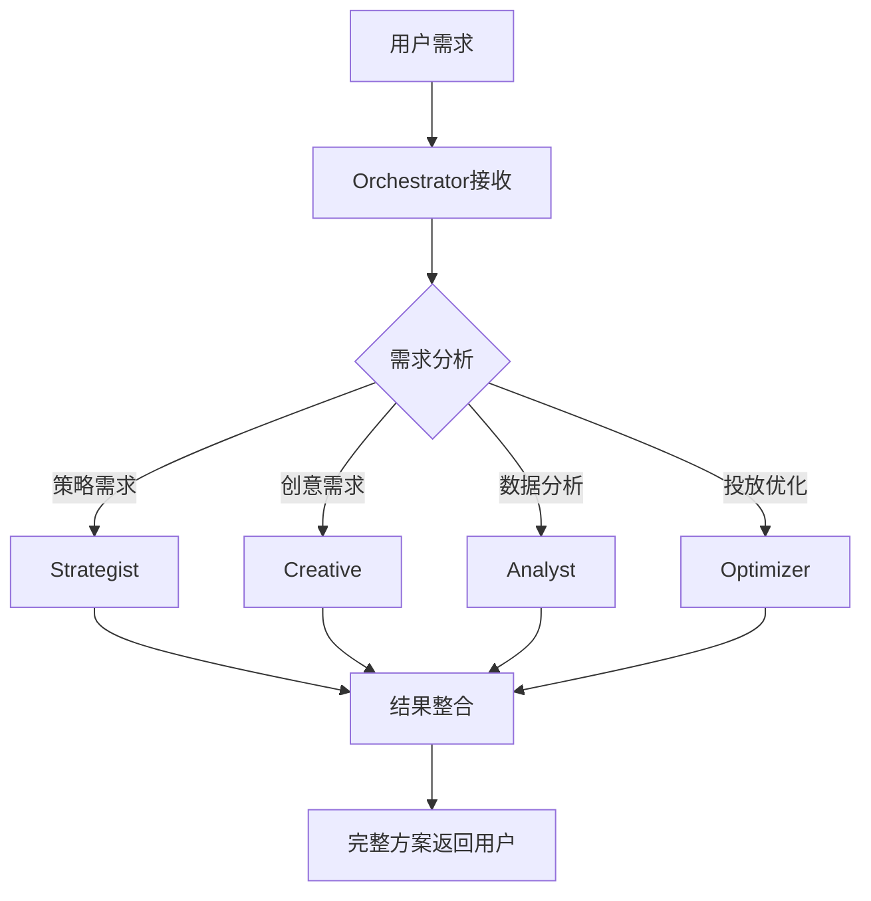

# OpenClaw Google Ads系统部署指南

## 📋 概述

本指南介绍如何部署和使用基于OpenClaw的Google Ads投放优化系统。该系统包含5个专业agents协同工作，提供从策略制定到投放优化的完整解决方案。

## 🎯 系统架构

### Agents组成

| Agent | 角色 | 职责 |
|-------|------|------|
| **google-ads-orchestrator** | 总协调员 | 接收需求、分发任务、整合结果 |
| **google-ads-strategist** | 策略专家 | 广告策略、预算分配、受众分析 |
| **google-ads-creative** | 创意专家 | 文案创作、创意设计、着陆页优化 |
| **google-ads-analyst** | 数据分析专家 | 数据监控、效果分析、报告生成 |
| **google-ads-optimizer** | 投放优化专家 | 关键词优化、出价调整、质量分提升 |

### 工作流程



## 🚀 快速部署

### 一键部署脚本

```bash
# 1. 克隆或复制部署文件
git clone https://github.com/jundihuang/toufang-skill.git
cd toufang-skill/openclaw-config

# 2. 运行部署脚本
chmod +x scripts/deploy-openclaw.sh
./scripts/deploy-openclaw.sh
```

### 手动部署步骤

1. **复制配置文件**
   ```bash
   cp templates/config-template.json ~/.openclaw/config.json
   ```

2. **创建工作空间**
   ```bash
   mkdir -p ~/.openclaw/workspace-google-ads
   cp -r workspace-templates/* ~/.openclaw/workspace-google-ads/
   ```

3. **更新系统提示词**
   ```bash
   python3 scripts/update-prompts.py --apply
   ```

4. **重启OpenClaw服务**
   ```bash
   openclaw gateway restart
   ```

## ⚙️ 配置说明

### 配置文件结构

```json
{
  "agents": {
    "google-ads-orchestrator": {
      "id": "google-ads-orchestrator",
      "systemPrompt": "...",
      "allowlist": {
        "subagents": ["strategist", "creative", "analyst", "optimizer"]
      }
    }
    // ... 其他agents配置
  },
  "agentToAgent": {
    "google-ads-orchestrator": {
      "canSpawn": ["strategist", "creative", "analyst", "optimizer"]
    }
  },
  "plugins": {
    "discord": {
      "enabled": true,
      "channels": {
        "main": {
          "channelId": "YOUR_CHANNEL_ID",
          "threads": {
            "enabled": true,
            "autoCreate": true
          }
        }
      }
    }
  }
}
```

### Discord配置

1. **创建Discord频道**
   - 频道名称: `google-ads-control`
   - 类型: 文本频道
   - 权限: 允许bot发送消息和创建子区

2. **获取频道ID**
   - 开启开发者模式
   - 右键点击频道 → 复制ID

3. **更新配置文件**
   - 将 `YOUR_CHANNEL_ID` 替换为实际的频道ID

## 💬 使用方式

### 基本使用

在配置好的Discord频道中，直接发送需求：

```
@google-ads-orchestrator 我想推广母亲节护肤礼盒，预算5000元
```

### 详细需求格式

```
@google-ads-orchestrator 

需求: 推广新产品
产品: 智能手表
预算: 10000元
目标: 获取100个试用用户
时间: 1个月
```

### 特定功能调用

```
# 只调用策略专家
@google-ads-orchestrator strategist: 帮我制定Q3广告策略

# 只调用创意专家
@google-ads-orchestrator creative: 需要新的广告文案

# 只调用数据分析
@google-ads-orchestrator analyst: 分析上周广告数据

# 只调用投放优化
@google-ads-orchestrator optimizer: 优化关键词出价
```

## 🔧 维护和更新

### 更新系统提示词

```bash
# 检查当前提示词
python3 scripts/update-prompts.py --list

# 模拟更新（不实际修改）
python3 scripts/update-prompts.py --dry-run

# 实际更新
python3 scripts/update-prompts.py --apply
```

### 创建提示词模板

```bash
python3 scripts/update-prompts.py --template prompts-template.json
```

### 备份和恢复

```bash
# 备份配置
cp ~/.openclaw/config.json ~/.openclaw/config.json.backup.$(date +%Y%m%d)

# 恢复配置
cp ~/.openclaw/config.json.backup.20240409 ~/.openclaw/config.json
```

## 📊 工作空间管理

### 文件结构

```
~/.openclaw/workspace-google-ads/
├── SOUL.md          # 工作空间定义
├── AGENTS.md        # Agents说明文档
├── TOOLS.md         # 工具配置
├── USER.md          # 用户信息
├── memory/          # 记忆存储
│   ├── strategies/  # 策略文档
│   ├── creatives/   # 创意素材
│   ├── reports/     # 分析报告
│   └── optimizations/ # 优化记录
└── projects/        # 项目文件
```

### 记忆管理

系统会自动在 `memory/` 目录中保存：
- 历史策略文档
- 成功的创意案例
- 数据分析报告
- 优化效果记录

使用 `memory_search` 和 `memory_get` 工具可以检索历史信息。

## 🐛 故障排除

### 常见问题

1. **Agents无法调用**
   ```
   错误: 检查agentToAgent配置
   解决: 确保orchestrator有canSpawn权限
   ```

2. **Discord消息发送失败**
   ```
   错误: 检查频道ID和bot权限
   解决: 确认频道ID正确，bot有发送消息权限
   ```

3. **工作空间文件缺失**
   ```
   错误: 自动创建工作空间失败
   解决: 手动创建目录和文件
   ```

### 日志检查

```bash
# 查看OpenClaw日志
journalctl -u openclaw-gateway -f

# 查看Discord插件日志
tail -f ~/.openclaw/logs/discord.log
```

### 服务状态检查

```bash
# 检查OpenClaw服务状态
openclaw gateway status

# 检查agents状态
openclaw agents list

# 检查Discord连接
openclaw plugins discord status
```

## 🔄 更新和升级

### 更新部署脚本

```bash
cd ~/toufang-skill/openclaw-config
git pull origin main
./scripts/deploy-openclaw.sh
```

### 添加新的Agents

1. 在 `config-template.json` 中添加新的agent配置
2. 更新 `agentToAgent` 权限
3. 创建相应的系统提示词
4. 运行部署脚本

### 集成新功能

1. **添加新的工具**
   - 在 `TOOLS.md` 中记录工具配置
   - 更新agents的systemPrompt包含工具使用说明

2. **扩展工作空间**
   - 在workspace中添加新的目录结构
   - 更新文件模板

## 📈 最佳实践

### 需求沟通
- 提供明确的产品信息和目标
- 指定预算范围和时间要求
- 分享历史数据和竞品信息

### 结果使用
- 策略文档作为投放指导
- 创意文案直接用于广告创建
- 数据分析用于效果评估
- 优化建议用于持续改进

### 持续优化
- 定期回顾历史项目
- 根据效果调整策略
- 更新创意和优化方法
- 扩展agents的能力范围

## 📞 支持

### 文档资源
- [OpenClaw官方文档](https://docs.openclaw.ai)
- [Discord开发者文档](https://discord.com/developers/docs)
- [Google Ads API文档](https://developers.google.com/google-ads/api)

### 社区支持
- [OpenClaw Discord社区](https://discord.com/invite/clawd)
- [GitHub Issues](https://github.com/jundihuang/toufang-skill/issues)

### 问题反馈
1. 在GitHub创建Issue
2. 在Discord社区提问
3. 查看现有问题和解决方案

---

**版本**: 1.0.0  
**最后更新**: 2026-04-09  
**作者**: Jayce  
**许可证**: MIT